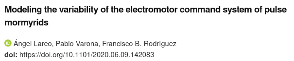

<!-- Please don't remove this: Grab your social icons from https://github.com/carlsednaoui/gitsocial -->
<!-- display the social media buttons in your README -->

<!-- links to social media icons -->
<!-- no need to change these -->

<!-- icons with padding -->

[1.1]: http://i.imgur.com/tXSoThF.png (twitter icon with padding)
[2.1]: http://i.imgur.com/P3YfQoD.png (facebook icon with padding)
[3.1]: http://i.imgur.com/0o48UoR.png (github icon with padding)

<!-- icons without padding. great to use in a sentence. -->

[1.2]: http://i.imgur.com/wWzX9uB.png (twitter icon without padding)
[2.2]: http://i.imgur.com/fep1WsG.png (facebook icon without padding)
[3.2]: http://i.imgur.com/9I6NRUm.png (github icon without padding)


<!-- links to your social media accounts -->
<!-- update these accordingly -->

[1]: http://www.twitter.com/ALFXogo
[2]: http://www.facebook.com/ALFXogo
[3]: http://www.github.com/angellareo

# Electromotor-nmodel
[](https://creativecommons.org/licenses/by-nc/4.0/)


 > Computational model of the electromotor command network of pulse-type mormyrids. Code also includes the genetic algorithm used to automatically tune the parameters of the model to predefined target patterns.
---

Please, if you use this model or the code of the genetic algorithm, cite in your publication the following paper:
[](https://www.biorxiv.org/content/10.1101/2020.06.09.142083v1)


## Build

Instructions are provided to build the project in Ubuntu.

First, clone the source repository from Github. From terminal, go to the directory you want to download the source code and run:
```
git clone https://github.com/GNB-UAM/electromotor-nmodel.git
```

Ǹow make sure you install all required packages
```
sudo apt-get install libboost-all-dev libyaml-cpp-dev libhdf5-dev libhdf5-cpp-103 git-all cmake
```
Now use cmake to compile the source and build the binaries.
```
cd electromotor-nmodel
mkdir bin
cd bin
cmake ..
make
```

## Usage

### emmodel

Simulates the electromotor command network using the parameters described by the input file. It outputs the current value of each synapse (E<sub>DP</sub>, E<sub>PCN</sub>,I<sub>DP</sub>, I<sub>PCN</sub>, E<sub>CDP</sub>) and the voltage from each neuron (VPd, DP, PCN and CN) in every time step of the simulation described in the config file (see [References](#References) for more information).

```
$ ./emmodel <option(s)> SOURCES

Options:
    -h, Show this message.
    -i, Input file.
    -o, Output file.
    -s, Print synapses.

```

The input file must be a valid YAML document describing the parameters. See the provided model configurations (ST, SGA, RGA) in `configs/`

### emmodelGAFit

Genetic algorithm that provides parameter optimization to adjust the output of the model to the target patterns provided as input (see [References](#References) for more information about the GA).


```
$ ./emmodelGAFit <option(s)> SOURCES

Options:
    -h, Show this message.
    -i, Input file.
    -o, Output file
    -h, Show this message.
    -i, Input file.
    -o, Output file
    -g, Number of generations.
    -e, Stop convergence value.
    -s, Statistics output file.
    -n, Number of individuals per generation.
    -a, Manual limits [-a,a] for alpha parameter.
    -b, Manual limits [-b,b] for beta parameter.
    -t, Manual limits [-t,t] for the conductivity parameter.
    -m, Manual limits [-m,m] for maximum release time parameter.
    -p, Percentual limits from the initial value of all parameters.
    -q, Print best GA each q generations.
```

The input file must be a valid YAML document describing the initial parameters and the target patterns used to adjust the parameters. See the provided model configurations (ST, SGA, RGA) in `configs/`

## Developed by 

Ángel Lareo <br/>
[![alt text][1.1]][1]
[![alt text][2.1]][2]
[![alt text][3.1]][3] <br/>
PhD in Universidad Autónoma de Madrid. Grupo de Neurocomputación biológica (GNB).


## References
 > A. Lareo, P. Varona. F. Rodríguez. Modeling the variability of the electromotor command system of pulse mormyrids. BioRxiv 10.1101/2020.06.09.142083
